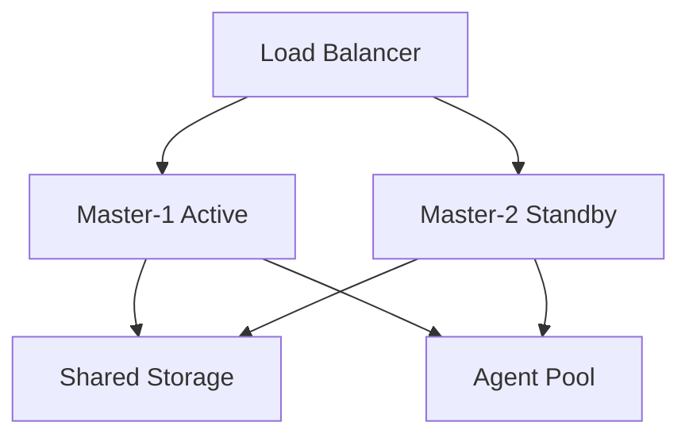

# High Availability Setup

## Understanding High Availability

### Core Concepts

#### What is High Availability?
- Continuous system operation
- Minimal downtime
- Fault tolerance
- Automatic failover

#### Key Components
1. Active-Passive Setup
   - Primary Jenkins master
   - Standby Jenkins master
   - Shared storage system
   - Load balancer configuration

2. Data Synchronization
   - File system replication
   - Database synchronization
   - Configuration management
   - Plugin state handling

## Architecture Patterns

### Active-Passive Configuration

#### Components Setup


#### Implementation Steps
1. Primary Master Setup:
   ```bash
   # Configure primary Jenkins
   jenkins.model.JenkinsLocationConfiguration.xml:
   <jenkins.model.JenkinsLocationConfiguration>
     <adminAddress>admin@example.com</adminAddress>
     <jenkinsUrl>https://jenkins.example.com</jenkinsUrl>
   </jenkins.model.JenkinsLocationConfiguration>
   ```

2. Standby Master Configuration:
   ```bash
   # Mirror primary configuration
   rsync -avz /var/jenkins_home/ standby:/var/jenkins_home/
   ```

### Shared Storage Configuration

#### NFS Setup
1. Server Configuration:
   ```bash
   # /etc/exports
   /jenkins_home *(rw,sync,no_root_squash)
   
   # Apply changes
   exportfs -a
   ```

2. Client Mount:
   ```bash
   # /etc/fstab
   nfs_server:/jenkins_home /var/jenkins_home nfs defaults 0 0
   ```

## Failover Configuration

### Automatic Failover

#### Health Checks
1. Basic Health Check:
   ```bash
   #!/bin/bash
   # check_jenkins_health.sh
   curl -f http://localhost:8080/login >/dev/null 2>&1
   if [ $? -eq 0 ]; then
       echo "Jenkins is healthy"
       exit 0
   else
       echo "Jenkins is not responding"
       exit 1
   fi
   ```

2. Advanced Monitoring:
   ```yaml
   # Prometheus configuration
   scrape_configs:
     - job_name: 'jenkins'
       metrics_path: '/prometheus'
       static_configs:
         - targets: ['jenkins:8080']
   ```

### Load Balancer Setup

#### HAProxy Configuration
```haproxy
global
    log /dev/log local0
    maxconn 4096

defaults
    log     global
    mode    http
    timeout connect 5000
    timeout client  50000
    timeout server  50000

frontend jenkins
    bind *:80
    default_backend jenkins_masters

backend jenkins_masters
    balance roundrobin
    option httpchk GET /login
    server master1 jenkins-master-1:8080 check
    server master2 jenkins-master-2:8080 check backup
```

## Data Synchronization

### File System Replication

#### Continuous Sync
1. Using Lsyncd:
   ```bash
   # /etc/lsyncd.conf
   settings {
       logfile = "/var/log/lsyncd.log",
       statusFile = "/var/log/lsyncd-status.log"
   }

   sync {
       default.rsync,
       source = "/var/jenkins_home",
       target = "standby:/var/jenkins_home",
       delay = 1,
       rsync = {
           archive = true,
           compress = true
       }
   }
   ```

2. Monitoring Sync Status:
   ```bash
   # Check sync status
   tail -f /var/log/lsyncd.log
   ```

## Backup and Recovery

### Backup Strategy

#### Automated Backups
1. Jenkins Home Backup:
   ```bash
   #!/bin/bash
   # jenkins_backup.sh
   BACKUP_DIR="/backup/jenkins"
   DATE=$(date +%Y%m%d)
   
   # Stop Jenkins
   systemctl stop jenkins
   
   # Create backup
   tar czf $BACKUP_DIR/jenkins_$DATE.tar.gz /var/jenkins_home
   
   # Start Jenkins
   systemctl start jenkins
   
   # Cleanup old backups
   find $BACKUP_DIR -type f -mtime +7 -delete
   ```

2. Database Backup (if applicable):
   ```sql
   -- Backup Jenkins database
   pg_dump jenkins_db > jenkins_db_backup.sql
   ```

### Recovery Procedures

#### Disaster Recovery
1. Quick Recovery Steps:
   ```bash
   # Restore from backup
   tar xzf jenkins_backup.tar.gz -C /
   chown -R jenkins:jenkins /var/jenkins_home
   systemctl restart jenkins
   ```

2. Verification Process:
   - Check system health
   - Verify job configurations
   - Test build execution
   - Validate plugins

## Monitoring and Maintenance

### Health Monitoring

#### Metrics Collection
1. JMX Monitoring:
   ```bash
   # Enable JMX
   export JENKINS_JAVA_OPTIONS="-Dcom.sun.management.jmxremote
     -Dcom.sun.management.jmxremote.port=8008
     -Dcom.sun.management.jmxremote.authenticate=false
     -Dcom.sun.management.jmxremote.ssl=false"
   ```

2. Grafana Dashboard Setup:
   ```yaml
   # Grafana dashboard configuration
   datasources:
     - name: Jenkins
       type: prometheus
       access: proxy
       url: http://prometheus:9090
   ```

## Hands-on Exercise

### Setting Up HA Environment

1. Primary Master Setup:
   ```bash
   # Install Jenkins
   wget -q -O - https://pkg.jenkins.io/debian/jenkins.io.key | sudo apt-key add -
   sudo sh -c 'echo deb http://pkg.jenkins.io/debian-stable binary/ > /etc/apt/sources.list.d/jenkins.list'
   sudo apt update
   sudo apt install jenkins
   
   # Configure shared storage
   mount -t nfs nfs_server:/jenkins_home /var/jenkins_home
   ```

2. Standby Master Configuration:
   ```bash
   # Clone primary configuration
   rsync -avz primary:/var/jenkins_home/ /var/jenkins_home/
   
   # Configure as standby
   echo "jenkins.model.Jenkins.instance.setMode(jenkins.model.Hudson.Mode.EXCLUSIVE)" >> /var/jenkins_home/init.groovy.d/standby.groovy
   ```

3. Load Balancer Setup:
   ```bash
   # Install HAProxy
   sudo apt install haproxy
   
   # Apply configuration
   sudo cp haproxy.cfg /etc/haproxy/
   sudo systemctl restart haproxy
   ```

### Testing Failover

1. Simulate Primary Failure:
   ```bash
   # Stop primary Jenkins
   sudo systemctl stop jenkins
   ```

2. Verify Failover:
   - Monitor HAProxy stats
   - Check standby activation
   - Verify job execution

## Additional Resources

- [Jenkins High Availability Guide](https://www.jenkins.io/doc/book/scaling/high-availability/)
- [HAProxy Configuration Manual](http://www.haproxy.org/download/2.4/doc/configuration.txt)
- [Jenkins Backup Strategies](https://www.jenkins.io/doc/book/system-administration/backing-up/)
- [Monitoring Jenkins](https://www.jenkins.io/doc/book/system-administration/monitoring/)