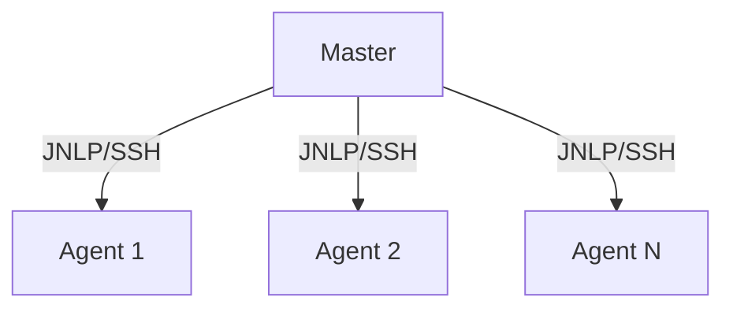

# Jenkins Architecture Fundamentals

## Core Architecture Components

### Master Server Architecture

#### Key Components
1. Jenkins Web Interface
   - Dashboard and job management
   - Configuration interface
   - Plugin management console
   - System monitoring views

2. Build Executor
   - Job scheduling system
   - Resource allocation
   - Queue management
   - Load balancing

3. Plugin System
   - Core plugin architecture
   - Plugin lifecycle management
   - Extension points
   - Plugin dependencies

### Agent Architecture

#### Agent Types
1. Static Agents
   - Permanent connection to master
   - Dedicated resources
   - Consistent environment
   - Ideal for stable workloads

2. Dynamic Agents
   - Cloud-based provisioning
   - On-demand scaling
   - Resource optimization
   - Cost-effective for variable loads

#### Agent Communication


## System Requirements

### Hardware Requirements

#### Master Node
1. Minimum Requirements:
   - CPU: 4 cores
   - RAM: 8GB
   - Disk: 50GB

2. Recommended Specifications:
   - CPU: 8+ cores
   - RAM: 16GB+
   - Disk: 100GB+ SSD

#### Agent Nodes
1. Base Requirements:
   - CPU: 2 cores
   - RAM: 4GB
   - Disk: 20GB

2. Workload-Specific Sizing:
   ```bash
   # Example resource calculation
   CONCURRENT_BUILDS=5
   RAM_PER_BUILD=2GB
   TOTAL_RAM=$((CONCURRENT_BUILDS * RAM_PER_BUILD + 2))GB
   ```

### Network Requirements

#### Connectivity
1. Port Requirements:
   ```plaintext
   Jenkins Master:
   - 8080: Web interface (HTTP)
   - 8443: Web interface (HTTPS)
   - 50000: Agent communication
   - 22: SSH (if using SSH agents)
   
   Agents:
   - Outbound access to master
   - Build-specific ports
   - Container registry ports (if using containers)
   ```

2. Firewall Considerations:
   - Allow master-agent communication
   - Configure proxy settings if needed
   - Enable SSL/TLS for secure communication
   - Set up network segmentation

### Performance Optimization

#### JVM Tuning
1. Memory Settings:
   ```bash
   # Recommended JVM settings
   export JENKINS_JAVA_OPTS="-Xmx4g -Xms2g \
     -XX:+UseG1GC \
     -XX:+ExplicitGCInvokesConcurrent \
     -XX:+ParallelRefProcEnabled \
     -XX:+UseStringDeduplication \
     -XX:+HeapDumpOnOutOfMemoryError"
   ```

2. Garbage Collection:
   - Monitor GC logs
   - Adjust heap size based on usage
   - Configure GC algorithm

#### System Monitoring
1. Key Metrics:
   - CPU usage
   - Memory consumption
   - Disk I/O
   - Network latency
   - Build queue length

2. Monitoring Tools:
   ```yaml
   # Prometheus configuration
   scrape_configs:
     - job_name: 'jenkins'
       metrics_path: '/prometheus'
       static_configs:
         - targets: ['jenkins:8080']
   ```

### Troubleshooting Guide

#### Common Issues
1. Memory Issues:
   ```bash
   # Check memory usage
   jmap -heap <jenkins_pid>
   
   # Analyze heap dump
   jhat jenkins_heap.hprof
   ```

2. Performance Problems:
   - Review system logs
   - Check resource utilization
   - Analyze build history
   - Monitor plugin performance
   - Master-agent communication
   - Source control access
   - Artifact repository access
   - Container registry access

## Scaling Considerations

### Vertical Scaling

#### Master Node Scaling
1. CPU Optimization:
   - Monitor build queue
   - Track system load
   - Analyze GC behavior
   - Optimize thread pools

2. Memory Management:
   ```java
   // Example JVM settings
   JAVA_OPTS="-Xmx4g -Xms4g -XX:+UseG1GC"
   ```

### Horizontal Scaling

#### Agent Pool Management
1. Static Pool:
   ```groovy
   // Jenkinsfile example
   pipeline {
     agent {
       label 'high-cpu'
     }
     stages {
       // Pipeline stages
     }
   }
   ```

2. Dynamic Scaling:
   ```yaml
   # Kubernetes agent example
   apiVersion: v1
   kind: Pod
   metadata:
     labels:
       type: jenkins-agent
   spec:
     containers:
     - name: maven
       image: maven:3.8.4
   ```

## Data Storage Strategy

### File System Storage

#### Directory Structure
```plaintext
/var/jenkins_home/
├── jobs/                 # Job configurations
├── plugins/              # Installed plugins
├── secrets/             # Security credentials
├── nodes/               # Agent configurations
└── workspace/           # Build workspaces
```

### Backup Strategy

#### Critical Data
1. Configuration Files:
   ```bash
   # Backup script example
   tar czf jenkins_backup.tar.gz \
     /var/jenkins_home/jobs \
     /var/jenkins_home/plugins \
     /var/jenkins_home/secrets
   ```

2. Job History:
   - Build logs
   - Artifacts
   - Test results
   - Coverage reports

## Performance Optimization

### Build Optimization

#### Pipeline Optimization
1. Parallel Execution:
   ```groovy
   parallel {
     stage('Unit Tests') {
       steps { /* test steps */ }
     }
     stage('Integration Tests') {
       steps { /* test steps */ }
     }
   }
   ```

2. Resource Management:
   - Workspace cleanup
   - Artifact management
   - Cache utilization

### System Tuning

#### JVM Optimization
1. Memory Settings:
   ```bash
   export JAVA_OPTS="-Xmx4g -Xms4g \
     -XX:+UseG1GC \
     -XX:+DisableExplicitGC \
     -XX:+AlwaysPreTouch"
   ```

2. Garbage Collection:
   - Monitor GC logs
   - Adjust collection strategy
   - Optimize heap size

## Hands-on Exercise

### Basic Setup

1. Install Jenkins Master:
   ```bash
   # Ubuntu/Debian
   wget -q -O - https://pkg.jenkins.io/debian/jenkins.io.key | sudo apt-key add -
   sudo sh -c 'echo deb http://pkg.jenkins.io/debian-stable binary/ > /etc/apt/sources.list.d/jenkins.list'
   sudo apt update
   sudo apt install jenkins
   ```

2. Configure System Resources:
   ```bash
   # Edit Jenkins service file
   sudo systemctl edit jenkins
   
   # Add resource limits
   [Service]
   LimitNOFILE=8192
   Environment="JAVA_OPTS=-Xmx2g -Xms2g"
   ```

### Agent Configuration

1. Create Static Agent:
   ```bash
   # On agent machine
   mkdir -p /var/jenkins_agent
   wget http://jenkins-master:8080/jnlpJars/agent.jar
   java -jar agent.jar -jnlpUrl http://jenkins-master:8080/computer/agent1/slave-agent.jnlp
   ```

2. Test Agent Connection:
   - Create test job
   - Assign to new agent
   - Verify execution

## Additional Resources

- [Jenkins Architecture Documentation](https://www.jenkins.io/doc/book/architecture/)
- [Scaling Jenkins](https://www.jenkins.io/doc/book/scaling/)
- [Jenkins Performance Tuning](https://www.jenkins.io/doc/book/system-administration/performance-tuning/)
- [Jenkins Security Best Practices](https://www.jenkins.io/doc/book/security/)