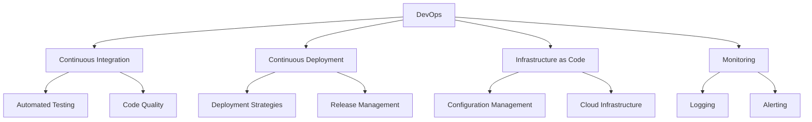

# DevOps Tools and Best Practices

## Core DevOps Principles

### 1. Automation First
- Automate repetitive tasks
- Infrastructure as Code (IaC)
- Configuration management
- Automated testing and deployment

### 2. Continuous Improvement
- Regular retrospectives
- Metrics-driven decisions
- Feedback loops
- Learning from incidents

### 3. Collaboration
- Breaking down silos
- Shared responsibility
- Cross-functional teams
- Knowledge sharing

## Essential DevOps Tools

### Version Control
- Git
- GitHub/GitLab/Bitbucket
- Branching strategies
- Code review practices

### CI/CD Tools
- Jenkins [[link to CI/CD docs]](/docs/ci-cd/getting-started)
- GitHub Actions
- GitLab CI
- ArgoCD

### Infrastructure Management
- Terraform
- Ansible
- Puppet
- Chef

### Containerization
- Docker [[link to Docker course]](/courses/docker-fundamentals)
- Kubernetes [[link to K8s post]](/blog/2024/01/15/kubernetes-deployment-strategies)
- Helm
- Podman

### Monitoring and Observability
- Prometheus
- Grafana
- ELK Stack
- Datadog

## DevOps Practices Mind Map

## DevOps Culture

### Team Structure
- Small, autonomous teams
- Clear ownership
- Shared goals
- Regular communication

### Communication Patterns
- Daily standups
- Sprint planning
- Retrospectives
- Documentation culture

### Incident Management
- On-call rotations
- Incident response
- Post-mortems
- Blameless culture

## Related Resources

### Books
- "The Phoenix Project"
- "The DevOps Handbook"
- "Accelerate"
- "Site Reliability Engineering"

### Communities
- DevOps Days
- Local DevOps meetups
- Online forums
- Professional networks

### Learning Paths
- [[Docker Fundamentals]](/courses/docker-fundamentals)
- [[CI/CD Pipeline Basics]](/docs/ci-cd/getting-started)
- [[Kubernetes Deployments]](/blog/2024/01/15/kubernetes-deployment-strategies)

## Notes and Updates

> This is a living document that will be updated regularly with new tools, practices, and insights from the DevOps community. Feel free to contribute and suggest improvements.

Last updated: January 2024